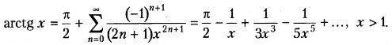

# Создание GUI с использованием флажков и переключателей
## Задание 1:
Реализовать вычисление кусочно-аналитической функции по индивидуальному варианту задания.
Использовать компоненты:
- текстовое поле для ввода аргумента `x`
- метка для вывода результата
- 3 радиокнопки для выбора формулы вычисления
- checkbox для возможности удвоения результата
- кнопка для вычисления результата
### Вариант 1:
$sin(x) + cos(x), x <= 0$\
$tg(x), 0 < x < 1$\
$x^3, x >= 1$

---

- [Реализация на C++](https://github.com/kepstersoncik/Application-Programming-Third-Semester/tree/master/CPP/CPP_S3AP_LW2E1)
- [Реализация на C#](https://github.com/kepstersoncik/Application-Programming-Third-Semester/tree/master/CSharp/CSharp_S3AP_LW2E1)
- [Реализация на Java](https://github.com/kepstersoncik/Application-Programming-Third-Semester/tree/master/Java/Java_S3AP_LW2E1/src)

---

## Задание 2:
Создать приложение для приближенного вычисления значения функции по степенному ряду. Вычисления продолжаются в дувух возможных режимах: либо до достижения заданной точности, либо когда число слогаемых превышает заданное число N

### Вариант 1:

---

- [Реализация на C++](https://github.com/kepstersoncik/Application-Programming-Third-Semester/tree/master/CPP/CPP_S3AP_LW1E2)
- [Реализация на C#](https://github.com/kepstersoncik/Application-Programming-Third-Semester/tree/master/CSharp/CSharp_S3AP_LW1E2)
- [Реализация на Java](https://github.com/kepstersoncik/Application-Programming-Third-Semester/tree/master/Java/Java_S3AP_LW1E2/src)
