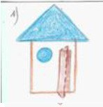

# Создание GUI с использованием текстовых полей, меток и кнопок
## Задание 1:
Загрузить jpeg изображение, его чать, и поверх первого изображения загрузить часть второго в прямоугольник первого.

Загрузить одно изображение, мышкой выделить прямоугольный фрагмент. Затем определить точку куда скопировать выделенную часть изибражения, начиная с выделенной точки после преобразования по варианту.э
### Вариант 1:
Получение черно-белого изображения.

---

- [Реализация на C++](https://github.com/kepstersoncik/Application-Programming-Third-Semester/tree/master/CPP/CPP_S3AP_LW5E1)
- [Реализация на C#](https://github.com/kepstersoncik/Application-Programming-Third-Semester/tree/master/CSharp/CSharp_S3AP_LW5E1)
- [Реализация на Java](https://github.com/kepstersoncik/Application-Programming-Third-Semester/tree/master/Java/Java_S3AP_LW5E1)

---

## Задание 2:
С помощью компоненты выбора цвета выбираются цвет линии, закраски и цвет движущегося фрагмента, при запуске 3 раза вызывается компонента выбора цвета.
Загрузить фон и изобразить картинку по варианту, фоном должно служить jpeg изображение.\

Нарисованную картинку сделать движущейся. Запуск анимации производится по нажатию кнопки, при этом скорость задается в текстовом поле.

---

- [Реализация на C++](https://github.com/kepstersoncik/Application-Programming-Third-Semester/tree/master/CPP/CPP_S3AP_LW5E2)
- [Реализация на C#](https://github.com/kepstersoncik/Application-Programming-Third-Semester/tree/master/CSharp/CSharp_S3AP_LW5E2)
- [Реализация на Java](https://github.com/kepstersoncik/Application-Programming-Third-Semester/tree/master/Java/Java_S3AP_LW5E2)
